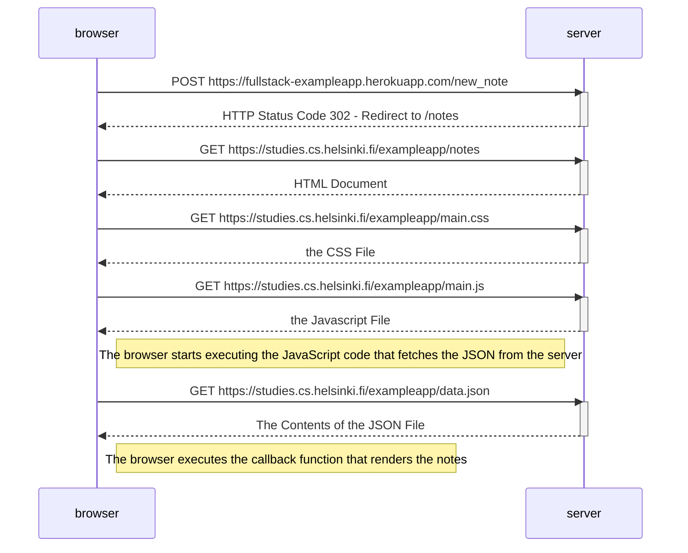

```mermaid
sequenceDiagram;
    participant browser
    participant server

    browser->>server: POST https://fullstack-exampleapp.herokuapp.com/new_note
    activate server
    server-->>browser: HTTP Status Code 302 - Redirect to /notes
    deactivate server

    browser->>server: GET https://studies.cs.helsinki.fi/exampleapp/notes
    activate server
    server-->>browser: HTML Document
    deactivate server

    browser->>server: GET https://studies.cs.helsinki.fi/exampleapp/main.css
    activate server
    server-->>browser: the CSS File
    deactivate server

    browser->>server: GET https://studies.cs.helsinki.fi/exampleapp/main.js
    activate server
    server-->>browser: the Javascript File
    deactivate server

    Note right of browser: The browser starts executing the JavaScript code that fetches the JSON from the server

    browser->>server: GET https://studies.cs.helsinki.fi/exampleapp/data.json
    activate server
    server-->>browser: The Contents of the JSON File
    deactivate server

    Note right of browser: The browser executes the callback function that renders the notes

```